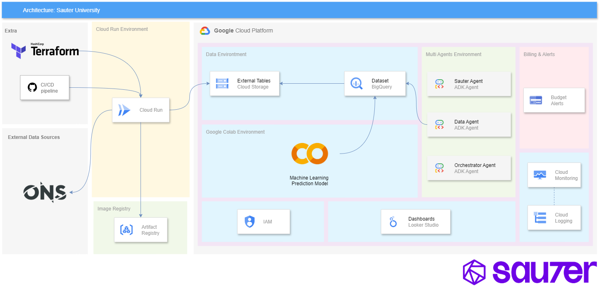

# Sauter University 2025 Challenge — Plataforma de Dados e ML/Agentes na Google Cloud



> Plataforma completa de dados na Google Cloud para ingestão, processamento e exposição de dados de reservatórios do ONS através de API REST, com análise avançada via modelo preditivo ou sistema multi-agente com RAG.

## 📋 Resumo Executivo

Este projeto desenvolve uma solução end-to-end na Google Cloud Platform que:

1. **Ingere dados** de reservatórios do ONS (Operador Nacional do Sistema Elétrico)
2. **Processa** via pipeline GCP (Cloud Storage + BigQuery)  
3. **Expõe** dados através de API REST em Python (FastAPI)
4. **Implementa** modelo de Machine Learning para previsão de ENA
5. **Visualiza** através de dashboard analítico no Looker Studio
6. **Garante** observabilidade, segurança e controle de custos (budget R$ 300)

### 🎯 Objetivos e KPIs
- **Acurácia do modelo ML**: > 70% para previsão de ENA
- **Cobertura de testes**: ≥ 85%
- **Orçamento**: Máximo R$ 300 com alertas configurados
- **SLO API**: p95 < 500ms, erro < 1%

## 👥 Equipe

| Nome | GitHub | Responsabilidade |
|------|---------|------------------|
| Genildo Burgos Barros | [@genildoburgos](https://github.com/genildoburgos) | Infraestrutura |
| Gustavo Ferreira Wanderley | [@MESTREGUGABr](https://github.com/MESTREGUGABr) | Engenheiro de Dados |
| Magno Silas Nunes Ramos | [@magnosillas](https://github.com/magnosillas) | Machine Learning Engineer |
| Pedro Tobias Souza Guerra | [@TobiasPedro1](https://github.com/TobiasPedro1) | Analista de Dados & Looker Studio |
| Vitor Antonio Silvestre | [@Vitorass0](https://github.com/Vitorass0) | Desenvolvedor Backend & API |

## 🏗️ Arquitetura da Solução

### Stack Técnica
- **Infraestrutura**: Terraform, GCP (Vertex AI Endpoints, BigQuery, Cloud Storage, Artifact Registry)
- **Backend**: Python 3.11+, FastAPI, Uvicorn, Pydantic
- **Dados**: ONS API, BigQuery, Cloud Storage (Parquet)
- **Observabilidade**: Cloud Monitoring, Cloud Logging, Budget Alerts
- **CI/CD**: GitHub Actions, Workload Identity Federation
- **Testes**: pytest, coverage ≥ 85%

### Fluxo de Dados
1. **Ingestão**: Coleta dados ONS → Cloud Storage (particionado) - *Vitor Silvestre, Pedro Tobias*
2. **Processamento**: BigQuery (tabelas externas → Trusted → Processed) - *Gustavo Wandereli*
3. **API**: FastAPI serve dados por data/período - *Vitor Silvestre*
4. **Análise**: Modelo de previsão (LSTM) implantado no Vertex AI Endpoints. O serviço busca features da camada Gold do BigQuery, gera as previsões e salva os resultados de volta no BigQuery para monitoramento. - *Magno Sillas*
5. **Visualização**: Dashboard Looker Studio - *Pedro Tobias*

## 🚀 Como Rodar Localmente

### Pré-requisitos
- Docker e Docker Compose
- Python 3.11+ (opcional, para desenvolvimento)
- Conta GCP com billing habilitado
- Git

### 🐳 Opção 1: Docker (Recomendado)

1. **Clone o repositório:**
```bash
git clone https://github.com/Sauter-University/sauter-university-2025-challenge.git
cd sauter-university-2025-challenge
```

2. **Suba o banco PostgreSQL (para desenvolvimento):**
```bash
docker-compose up -d
```

3. **Configure e execute a API:**
```bash
# Criar arquivo de ambiente (ainda não existe .env.example)
# TODO: Criar src/api/.env com credenciais GCP

# Instalar dependências
cd src/api
python -m venv .venv
source .venv/bin/activate  # Linux/Mac
pip install -r requirements.txt

# Executar API
uvicorn main:app --host 0.0.0.0 --port 8000 --reload
```

4. **Acesse a aplicação:**
- API: http://localhost:8000
- Documentação: http://localhost:8000/docs
- PostgreSQL: localhost:5432 (user: university, password: university)

### 🐍 Opção 2: Desenvolvimento Local

1. **Instale dependências:**
```bash
cd src/api
python -m venv .venv
source .venv/bin/activate  # Linux/Mac
# .venv\Scripts\activate   # Windows
pip install -r requirements.txt
```

2. **Configure ambiente:**
```bash
cp .env.example .env
# Edite .env com suas credenciais GCP e configurações
```

3. **Execute a API:**
```bash
uvicorn main:app --host 0.0.0.0 --port 8000 --reload
```

### ⚙️ Configuração de Ambiente

#### Variáveis Obrigatórias (.env)
```bash
# ONS API
ONS_API_URL=https://dados.ons.org.br/api/3/action/package_show

# Google Cloud Storage
GCS_BUCKET_NAME=seu-bucket-name

# Credenciais GCP (escolha uma opção)
GOOGLE_CREDENTIALS_JSON='{"type":"service_account",...}'
# OU
GOOGLE_APPLICATION_CREDENTIALS=/path/to/service-account.json

# Configurações da aplicação
API_AUTH_MODE=apikey
LOG_LEVEL=INFO
```

## 🏗️ Deploy da Infraestrutura

### 1. Configurar Terraform
```bash
cd src/terraform
cp terraform.tfvars.example terraform.tfvars
# Configure suas variáveis GCP
```

### 2. Aplicar Infraestrutura
```bash
terraform init
terraform plan -out=tfplan
terraform apply tfplan
```

### 3. Verificar Recursos Criados
- Cloud Run service
- BigQuery datasets 
- Cloud Storage buckets
- Artifact Registry
- Budget e alertas
- IAM roles e service accounts

## 📊 Endpoints da API

### Principais Endpoints

| Método | Endpoint | Descrição |
|--------|----------|-----------|
| `GET` | `/healthz` | Health check |
| `GET` | `/metrics` | Métricas Prometheus |
| `GET` | `/v1/ena/reservatorios/{id}/daily?date=YYYY-MM-DD` | Dados diários de reservatório |
| `GET` | `/v1/ena/reservatorios/{id}/historico?start_date&end_date` | Dados históricos |
| `GET` | `[https://modelo-ena-api-332613513827.us-central1.run.app/prever?data_base=2023-01-01](https://modelo-ena-api-332613513827.us-central1.run.app/prever?data_base=2023-01-01)` | Previsão ML |

### Trilhos Específicos
**Trilho A (Modelo Preditivo):**
- `GET /prever?horizonte=30` (Endpoint implantado no Vertex AI que retorna a previsão para os próximos N dias).

**Trilho B (Multi-Agente):**
- `POST /v1/agents/query` → `{question: "..."}`

## 🧪 Testes e Validação

### Executar Testes
```bash
# Testes unitários
cd src/api
pytest tests/ --cov=. --cov-report=html

# Verificar cobertura (mínimo 85%)
coverage report --show-missing
```

### Validação de Qualidade
```bash
# Lint e formatação
ruff check src/ --fix
ruff format src/

# Type checking
mypy src/ --config-file=pyproject.toml

# Build Docker
docker build -t university-api .
```

### Métricas de Qualidade
- **Cobertura de testes**: ≥ 85%
- **Lint score**: 10/10 (ruff)
- **Type coverage**: 100% (mypy)
- **Performance**: API < 500ms p95

## 📈 Observabilidade e Monitoramento

### Dashboards e Métricas
- **Cloud Monitoring**: Latência, taxa de erro, QPS
- **Cloud Logging**: Logs estruturados JSON com trace_id
- **Budget Alerts**: 50%, 75%, 90% 100% do orçamento R$ 300
- **SLO**: p95 < 500ms, taxa de erro < 1%

### Logs e Debugging
```bash
# Ver logs Cloud Run
gcloud logging read "resource.type=cloud_run_revision" --limit=50

# Métricas da aplicação
curl http://localhost:8000/metrics
```

### Runbook para Incidentes

#### 🚨 API Não Responde
1. Verificar health check: `GET /healthz`
2. Checar logs: Cloud Console → Cloud Run → Logs
3. Verificar recursos: CPU/Memory no Cloud Monitoring
4. Rollback se necessário: `gcloud run services update-traffic`

#### 💰 Alerta de Custo
1. Verificar dashboard de billing
2. Identificar recursos com maior custo
3. Revisar queries BigQuery (slot usage)
4. Considerar pausar ingestão não-crítica

## 🔐 Segurança

### Boas Práticas Implementadas
- ✅ **Secrets**: Uso de `.env` (nunca commitar credenciais)
- ✅ **IAM**: Princípio do menor privilégio
- ✅ **WIF**: Workload Identity Federation (sem service account keys)
- ✅ **API**: Rate limiting e validação de input
- ✅ **Network**: Cloud Run com ingress controlado

### Permissões Mínimas Necessárias
```yaml
# Service Account para API
roles:
  - roles/bigquery.dataViewer
  - roles/storage.objectViewer
  - roles/cloudsql.client

# Service Account para CI/CD
roles:
  - roles/run.developer
  - roles/artifactregistry.writer
  - roles/iam.serviceAccountUser
```

## ☁️ Google Cloud CLI (gcloud) - Resumo Prático

### 🔧 **Setup Inicial (Uma vez por desenvolvedor)**
```bash
# Instalar gcloud CLI
curl https://sdk.cloud.google.com | bash && exec -l $SHELL

# Configurar projeto
gcloud auth login
gcloud config set project sauter-university-2025
gcloud auth application-default login  # Para desenvolvimento local
```

### 🛡️ **Práticas de Segurança Essenciais**

#### ✅ **O que FAZER:**
```bash
# Usar Application Default Credentials (desenvolvimento)
gcloud auth application-default login

# Verificar permissões antes de executar
gcloud config list
gcloud projects test-iam-permissions sauter-university-2025 --permissions="run.services.create"

# Monitorar custos e atividades
gcloud logging read "severity>=WARNING" --limit=10
gcloud billing budgets list
```

#### ❌ **O que NUNCA fazer:**
```bash
# ❌ Commitar chaves JSON
git add service-account-key.json

# ❌ Usar service account keys em produção
gcloud auth activate-service-account --key-file=key.json

# ❌ Dar permissões excessivas
gcloud projects add-iam-policy-binding --role="roles/owner"

# ❌ Expor serviços sem autenticação
gcloud run deploy --allow-unauthenticated  # Só em dev!
```

### 🚨 **Troubleshooting Rápido**
```bash
# Problemas de autenticação
gcloud auth list && gcloud auth login

# Problemas de deploy
gcloud run services describe university-api --region=us-central1
gcloud logs read "severity>=ERROR" --limit=5

# Verificar configuração
gcloud config list --all
gcloud info --run-diagnostics
```

## 🏗️ Estrutura do Projeto

```text
/
├── .github/workflows/       # CI/CD pipeline (ci.yaml, cd.yaml)
├── .git/                   # Controle de versão Git
├── .venv/                  # Ambiente virtual Python (local)
├── doc/challenge/          # Documentação e diagramas
├── img/                    # Imagens do projeto
├── src/
│   ├── api/                # API FastAPI
│   │   ├── main.py         # Aplicação principal
│   │   ├── requirements.txt # Dependências Python
│   │   ├── core/           # Módulos core (exceptions, logging, ons_client)
│   │   ├── models/         # Modelos de dados (basin.py)
│   │   ├── repositories/   # Camada de dados (basin_repository, gcs_repository)
│   │   ├── routers/        # Rotas da API (basin.py)
│   │   └── services/       # Lógica de negócio (basin_service)
│   ├── querys/             # Queries SQL BigQuery
│   │   ├── create_ena_bronze.sql
│   │   ├── create_ena_silver.sql
│   │   └── create_external_table.sql
│   └── terraform/          # Infraestrutura como código
│       ├── modules/        # Módulos Terraform
│       │   ├── artifact_registry/
│       │   ├── bigquery/
│       │   ├── budget/
│       │   ├── cloud_run/
│       │   ├── cloud_storage/
│       │   ├── iam/
│       │   ├── monitoring/
│       │   ├── security_policies/
│       │   └── wif/        # Workload Identity Federation
│       ├── main.tf
│       ├── variables.tf
│       ├── outputs.tf
│       └── terraform.tfvars.example
├── docker-compose.yml      # PostgreSQL para desenvolvimento
├── Dockerfile              # Containerização da API
├── .gitignore              # Arquivos ignorados pelo Git
└── README.md               # Este arquivo
```

## 📋 Casos de Uso

### 🎯 Casos de Uso Prioritários

1. **[P0] Ingestão de Dados ONS**
   - Como analista, quero dados atualizados de ENA para análise
   - Critério: Dados ingeridos diariamente com < 2h de atraso

2. **[P0] API de Consulta Histórica**
   - Como usuário, quero consultar dados por período específico
   - Critério: Resposta < 500ms para consultas históricas

3. **[P1] Dashboard Analítico**
   - Como gestor, quero visualizar tendências e KPIs
   - Critério: Dashboard atualizado em tempo real

4. **[P1] Análise Avançada (Trilho A ou B)**
   - Como especialista, quero previsões/insights inteligentes
   - Critério: Acurácia > 70% ou respostas contextuais relevantes

### 🔄 CI/CD Pipeline

#### Continuous Integration
- **Trigger**: Pull Request para `main`
- **Steps**: Lint → Type Check → Tests → Coverage → Build
- **Gates**: Cobertura ≥ 85%, todos os checks verdes

#### Continuous Deployment  
- **Trigger**: Push para `main`
- **Steps**: Build → Push Registry → Deploy Cloud Run → Health Check
- **Rollback**: Automático em caso de falha no health check

```bash
# Deploy manual (se necessário)
gcloud run deploy university-api \
  --image=gcr.io/PROJECT/university-api:latest \
  --region=us-central1 \
  --allow-unauthenticated
```

## 🎨 Dashboard e Analytics

### Looker Studio Dashboard
- **Responsável**: Pedro Tobias (Analista de Dados)
- **URL**: [Dashboard Sauter University](https://lookerstudio.google.com/reporting/6230a252-40a5-4b56-9f18-8c5b1289bd72)
- **Fonte de Dados**: Views otimizadas do BigQuery
- **Gráficos**: Séries temporais ENA, distribuições, correlações entre reservatórios
- **Atualização**: Automática a cada 1 hora
- **Métricas**: KPIs operacionais, previsões ML, alertas de anomalias

### Justificativa dos Gráficos (Pedro Tobias)
1. **Série temporal ENA**: Tendências sazonais e anomalias
2. **Mapas de calor**: Correlação entre reservatórios  
3. **Distribuições**: Análise estatística dos volumes
4. **Indicadores KPI**: Status operacional em tempo real

## 📝 Registro de Decisões Arquiteturais (ADR)

### ADR-001: Escolha da Cloud Platform (2025-09-25)
- **Decisão**: Google Cloud Platform
- **Alternativas**: AWS, Azure
- **Justificativa**: BigQuery para analytics, Cloud Run serverless, créditos educacionais
- **Responsável**: Genildo Burgos (Dev Ops)

### ADR-002: Framework de API Backend (2025-09-25)
- **Decisão**: FastAPI com Pydantic para validação
- **Alternativas**: Django REST Framework, Flask-RESTful
- **Justificativa**: Performance superior, documentação automática OpenAPI, type hints nativos, async support
- **Responsável**: Vitor Silvestre (Backend & API)

### ADR-003: Estratégia de Pipeline de Dados (2025-09-25)
- **Decisão**: Arquitetura Medallion (Bronze → Silver → Gold) no BigQuery
- **Alternativas**: Data Lake simples, Star Schema tradicional
- **Justificativa**: Separação clara de responsabilidades, data quality por camadas, escalabilidade
- **Responsável**: Gustavo Wanderley (Engenharia de Dados)

### ADR-004: Trilho de Análise Avançada (2025-09-25)
- **Decisão**: Modelo Preditivo de Machine Learning para previsão de ENA
- **Alternativas**: Sistema Multi-Agente com RAG
- **Justificativa**: Expertise da equipe em ML, dados estruturados ONS ideais para previsão temporal, acurácia mensurável > 70%
- **Responsável**: Magno Silas (Data Engineering & ML)

### ADR-005: Plataforma de Dashboard e Visualização (2025-09-25)
- **Decisão**: Looker Studio para dashboard analítico
- **Alternativas**: Tableau, Power BI, Grafana
- **Justificativa**: Integração nativa BigQuery, gratuito, facilidade de compartilhamento, templates prontos
- **Responsável**: Pedro Tobias (Analista de Dados & QA)


## 🗓️ Changelog

### v1.0.0 (2025-09-25)
- ✅ Setup inicial do repositório
- ✅ Configuração Docker e Docker Compose
- ✅ Estrutura base da API FastAPI
- ✅ Pipeline CI/CD básico
- ✅ Documentação README
- ✅ Implementação da ingestão ONS
- ✅ Setup completo BigQuery  
- ✅ Endpoints da API v1
- ✅ Escolha e implementação do trilho
- ✅ Dashboard Looker Studio
- ✅ Testes e cobertura ≥ 85%

## 🤝 Como Contribuir

1. **Fork** o repositório
2. **Crie** uma branch: `git checkout -b feat/nova-funcionalidade`
3. **Commit** seguindo [Conventional Commits](https://conventionalcommits.org/)
4. **Push** para a branch: `git push origin feat/nova-funcionalidade`
5. **Abra** um Pull Request

### Padrões de Commit
```
feat: adiciona endpoint de previsão
fix: corrige validação de datas
docs: atualiza README com instruções
test: adiciona testes para ingestão
```

## 📞 Suporte e Contato

- **Issues**: [GitHub Issues](https://github.com/Sauter-University/sauter-university-2025-challenge/issues)
- **Discussions**: [GitHub Discussions](https://github.com/Sauter-University/sauter-university-2025-challenge/discussions)
- **Contato**: Contato através dos perfis GitHub da equipe


---


**🎓 Sauter University 2025 Challenge** - Desenvolvido com ☕ pela equipe 


